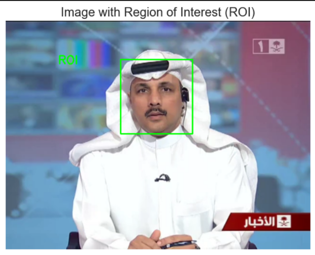

  

<h3 align="center">Exploring Deepfake and Shallowfake Images</h3>

---

 With the advancement of technologies like deepfakes and shallowfakes, the ability to manipulate and fabricate images has become increasingly sophisticated, making it difficult to distinguish real from fake. 
This research aims to explore the potential of image visualization and manipulation techniques in detecting and identifying two types of synthetic media: shallowfakes and deepfakes. 
We will explain more about Data Visualization Here.
      

## 📝 Table of Contents

- [Dataset](#dataset)
- [Data visualization](#data_visualization)
- [Data Analysis](#data_analysis)
- [Preprocessing Techniques](#preprocessing)

## 💡 Dataset 
Our dataset is composed of two distinct categories: shallow fakes and deep fakes. Each category is further divided into two subsets: a training set containing both authentic and fake images, and a test set containing real and fabricated images. All models will be trained and evaluated on the entirety of this data.   
     
  

## 🧐 Data Visualization 

The Data visualization transforms raw data into visually appealing representations, like charts and maps. It's like translating data into a language our brains understand more easily, helping us spot trends, patterns, and hidden stories within the information. This makes data accessible and impactful, leading to better understanding, communication, and decision-making.  
In This code we've used a set of visualization methods such us :   
- <b>Histograms :</b>  
Understanding the distribution of features within your image dataset is crucial for building effective deep learning models. This is where histograms come in, offering a powerful visual tool to analyze the frequency of different values for specific features, like pixel intensities or filter activations.   
  
 => Here we used the histogram to analyse the distribution of the shallowfake dataset (casiav2) and we interpret from it that the real images are more frequent than the fake ones
    
     
=> Analyzing a deepfake image's pixel distribution reveals valuable information about its authenticity. Look for unnatural uniformity, inconsistent patterns, unusual peaks/dips, or repeating patterns. Compare with the original image, if available, for significant differences. Pixel distribution analysis is just one tool, combine it with other techniques for a more robust approach.    
  
=> Analyzing the pixel intensity of a suspected deepfake can expose its authenticity. Look for unnatural brightness/contrast, inconsistent lighting/color, and unusual intensity outliers. Compare with the original image for significant differences. Pixel intensity analysis is just one tool, combine it with other techniques for a more robust approach.
 - <b> Pie charts : </b>  
 Pie charts offer a simple and intuitive way to visualize the distribution of different classes or categories within your image dataset. Think of them as colorful slices of a pie, each representing the proportion of a specific class.   
  
=> The visual representation revealed that real images are more prevalent than fake ones. The pie charts provided a clear and concise depiction of the dataset's composition, highlighting the relative frequency of real and fake images.

## ⛓️ Data Analysis 

- <b> Image Segmentation : </b>  
Image segmentation plays a crucial role in analyzing deep fake and shallow fake images. It involves separating the image into different regions based on visual features like color, texture, and edges. This helps identify areas that are more likely to be manipulated, such as faces, backgrounds, and objects. 
   
- <b> Gabor Filter response (Image Texture) </b>  
Analyze shallowfake by applying Gabor filters. These filters capture specific textures, revealing inconsistencies in manipulated areas. Compare the filter response of a suspected deepfake to a real image to identify unnatural textures, potentially indicating manipulation. This information helps improve deepfake detection accuracy.
  
   

## 🚀 Preprocessing Techniques 
Preprocessing can significantly improve our deepfake and shallow fake detection efforts. By cleaning noise and artifacts, it enhances feature extraction, allowing us to identify subtle manipulation clues. This leads to more accurate detection, reduced bias in the results, and improved efficiency in our analysis workflow.  
These are some preprocessing techniques that we used in our code :  
- <b> Image to RGB : </b>  
Deepfakes manipulate color channels to blend seamlessly. Converting to RGB lets you analyze each channel separately. By comparing color values in both images, you can identify discrepancies that hint at manipulation
  
   
- <b> Grayscale : </b>  
Deepfakes often tamper with brightness to blend seamlessly. Analyze both images in grayscale to focus on brightness patterns. Compare these grayscale versions to identify any inconsistencies, potentially revealing manipulation. Removing color distractions exposes subtle clues missed in full-color, boosting deepfake detection.
  
   
- <b> blurred : </b>  
Shallowfakes often blur to blend in. Analyze a blurred version alongside the original to spot inconsistencies. Unnatural blurs or artifacts highlight potential manipulation, boosting shallowfake detection.
  
   
- <b> Region of interest (ROI) : </b>  
Deepfakes often focus manipulation on specific areas, like faces. By analyzing only the region of interest (ROI) in both the suspected deepfake and the original image, you can zoom in on potential manipulation clues. This allows for a more focused analysis and reduces distractions from irrelevant background details.
  
   
 

  <b> Conclusion : </b>  
Analyzing features, visualizing data, and using preprocessing techniques like grayscale, blurring, and ROI successfully detected deepfakes. This approach shows promise and invites further research on expanding datasets, integrating machine learning, and enabling real-time detection. Our work highlights the power of data-driven methods in combating deepfakes, emphasizing the need for continued vigilance in this evolving field.

